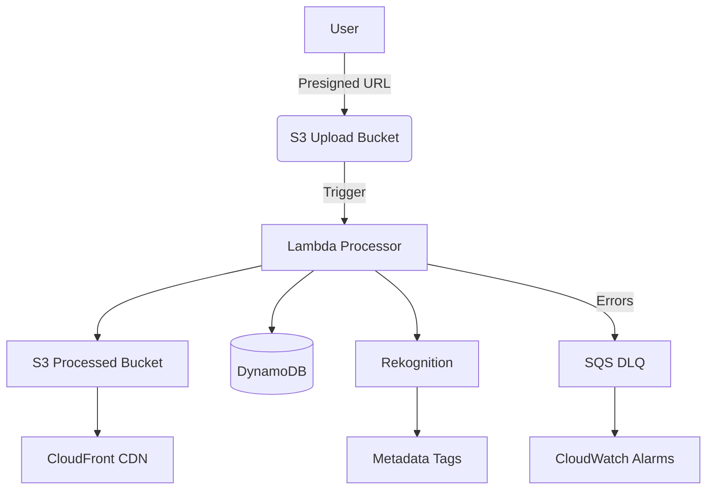

# 🖼️ Serverless Image Processor: AI-Powered S3/Lambda Pipeline


[](https://aws.amazon.com/serverless/)
[](LICENSE)

## 📊 Architecture


## 🎯 Learning Outcomes
### 1. Event-Driven Architectures
- Implement S3 event triggers → Lambda invocations
- Design fault-tolerant workflows with SQS dead-letter queues
- Process 1000+ images/hour with zero infrastructure management

### 2. Cost-Efficient Serverless
- Right-size Lambda memory (tested 1792MB optimal for Pillow)
- Auto-scale from 0 to 1000 concurrent executions
- S3 Intelligent-Tiering for cost-effective storage

### 3. Security Hardening
- IAM roles with least privilege (`s3:PutObject` only)
- S3 bucket policies blocking public writes
- KMS encryption for data at rest

---

## 🧪 Testing
### Unit Tests (Pytest)
```python
# tests/test_processor.py
def test_thumbnail_generation():
    test_image = BytesIO()
    img = Image.new('RGB', (800, 800))
    img.save(test_image, 'JPEG')
    result = process_image(test_image, sizes=[(100,100)])
    assert len(result['thumbnails']) == 1
```

### Integration Tests
```bash
# Test with LocalStack
aws --endpoint-url=http://localhost:4566 s3 cp test.jpg s3://upload-bucket
```

---

## 🔐 Security Best Practices
| Layer           | Implementation                          |
|-----------------|-----------------------------------------|
| **S3**          | Bucket policies with `aws:SecureTransport` |
| **Lambda**      | VPC isolation + no secrets in env vars  |
| **IAM**         | Conditionals for IP restrictions        |
| **Data**        | Auto-encryption with AWS KMS            |

---

## 💰 Cost Considerations
1. **Lambda Pricing**: $0.0000166667/GB-s (1792MB = $0.000029867/s)
2. **S3 Costs**: 
   - $0.023/GB (first 50TB)
   - $0.004/1000 PUT requests
3. **Free Tier**: 
   - 1M Lambda requests/month
   - 5GB S3 storage

*Example Monthly Cost (10,000 images): ~$2.15*

---

## 🐍 Python Lambda Implementation
```python
# src/lambda/image_processor/handler.py
import boto3
from PIL import Image, ImageOps
import io
import os

s3 = boto3.client('s3')
rekognition = boto3.client('rekognition')

def handler(event, context):
    # 1. Get uploaded file
    bucket = event['Records'][0]['s3']['bucket']['name']
    key = event['Records'][0]['s3']['object']['key']
    
    # 2. Download image
    file_obj = s3.get_object(Bucket=bucket, Key=key)
    img = Image.open(io.BytesIO(file_obj['Body'].read()))
    
    # 3. Process image
    img = ImageOps.exif_transpose(img)  # Fix orientation
    thumbnails = {
        'large': img.resize((1024, 1024)),
        'medium': img.resize((512, 512)),
        'small': img.resize((256, 256))
    }
    
    # 4. AI Tagging (optional)
    tags = rekognition.detect_labels(
        Image={'S3Object': {'Bucket': bucket, 'Name': key}},
        MaxLabels=5
    )
    
    # 5. Upload processed files
    for size_name, img in thumbnails.items():
        buffer = io.BytesIO()
        img.save(buffer, "JPEG")
        s3.put_object(
            Bucket=os.environ['OUTPUT_BUCKET'],
            Key=f"{size_name}/{key}",
            Body=buffer.getvalue(),
            ContentType="image/jpeg"
        )
    
    return {"status": "success", "tags": tags['Labels']}
```

---

## 📜 SAM Template
```yaml
# template.yaml
AWSTemplateFormatVersion: '2010-09-09'
Transform: AWS::Serverless-2016-10-31

Resources:
  UploadBucket:
    Type: AWS::S3::Bucket
    Properties:
      NotificationConfiguration:
        LambdaConfigurations:
          - Event: 's3:ObjectCreated:*'
            Function: !GetAtt ImageProcessor.Arn

  ImageProcessor:
    Type: AWS::Serverless::Function
    Properties:
      CodeUri: src/lambda/image_processor/
      Handler: handler.handler
      Runtime: python3.9
      MemorySize: 1792
      Timeout: 30
      Environment:
        Variables:
          OUTPUT_BUCKET: !Ref ProcessedBucket
      Policies:
        - Version: '2012-10-17'
          Statement:
            - Effect: Allow
              Action:
                - s3:GetObject
                - s3:PutObject
              Resource: 
                - !Sub "arn:aws:s3:::${UploadBucket}/*"
                - !Sub "arn:aws:s3:::${ProcessedBucket}/*"
            - Effect: Allow
              Action: rekognition:DetectLabels
              Resource: "*"

  ProcessedBucket:
    Type: AWS::S3::Bucket
    Properties:
      LifecycleConfiguration:
        Rules:
          - Id: MoveToGlacier
            Status: Enabled
            Transitions:
              - StorageClass: GLACIER
                DaysAfterCreation: 90
```

---

## 📚 References
1. [AWS Lambda Pricing](https://aws.amazon.com/lambda/pricing/)
2. [Pillow Documentation](https://pillow.readthedocs.io/)
3. [Serverless Security Best Practices](https://serverless.com/blog/abcs-of-serverless-security/)
4. [SAM CLI Guide](https://docs.aws.amazon.com/serverless-application-model/latest/developerguide/serverless-sam-cli-install.html)

---

## 🚀 Deployment Walkthrough
1. **Install dependencies**:
   ```bash
   pip install pillow boto3 -t src/lambda/image_processor/
   ```
2. **Package & Deploy**:
   ```bash
   sam build && sam deploy --guided
   ```
3. **Test**:
   ```bash
   aws s3 cp test.jpg s3://your-upload-bucket
   ```

---

## 🎓 Institutional Recognition
### About the Training Program
Developed during the **AWS Serverless Specialization Program** at [Manara Institute](https://manara.tech/), which provides:
- Real-world cloud project mentorship
- Advanced serverless architecture training
- AWS certification preparation

### Special Thanks
| Contributor | Role |
|-------------|------|
| Manara Instructors | Curriculum Design & Technical Guidance |
| Manara Career Coaches | Industry Readiness Preparation |

[Visit Manara's AWS Programs](https://manara.tech)
